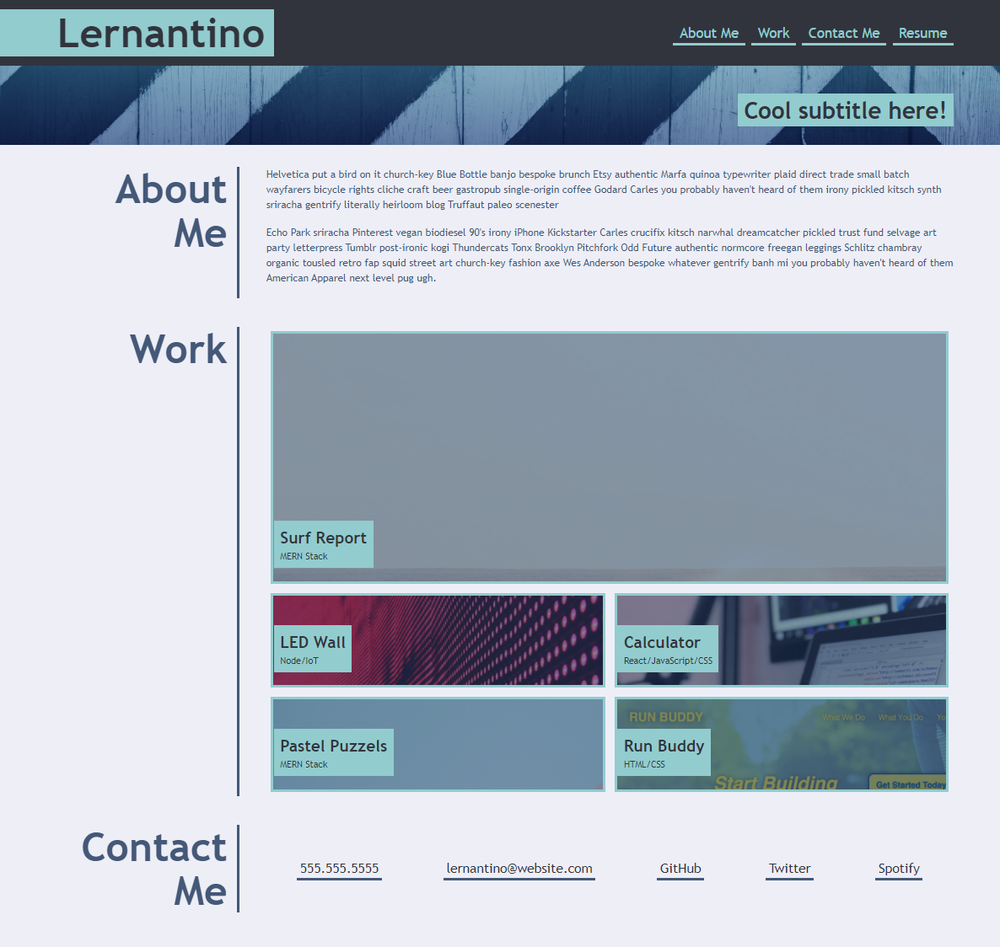
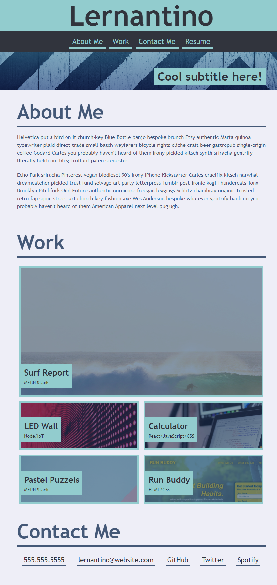
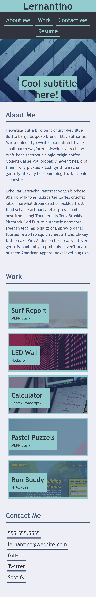

# devious_doge_portfolio
# <Your-Project-Title>

## Description

First public draft of my professional portfolio. This is my first real website I have built from the ground up and while simple and somewhat silly I like how it turned out. Website was built to vaguely resemble a specific template as instructed. Certain contents were modified to various degrees for functional and aesthetic reasons. Pictured below was the targeted template:

## Desktop
 

## Tablet

## Mobile

Upon building and designing this webpage I learned a great deal about more advanced concepts of CSS properties, but also learned more about concepts like font-families and color palletes. I learned how to troubleshoot and debug accounting for different devices from the comfort of google chrome, and I think I have built up a solid knowledge basis the fundamentals of web design in preperation for more advanced web development skillsets. 

## Installation

1. Thanks to the World Wide Web you can view this document from any net-connected device using the following HyperText Transfer Protocol Secure Address: https://deviousdoge.github.io/devious_doge_portfolio/

2. Source code can be viewed by cloning the repository found here to your local machine using git bash (PC) or HomeBrew (Mac): https://github.com/DeviousDoge/devious_doge_portfolio

3. Document is structured with index.html and styled with reset.css and style.css

## Usage

## Desktop

## Tablet

## Mobile

## Credits

Code Snippet used for overlay: https://www.w3schools.com/howto/howto_css_image_overlay_title.asp

